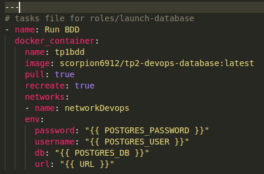
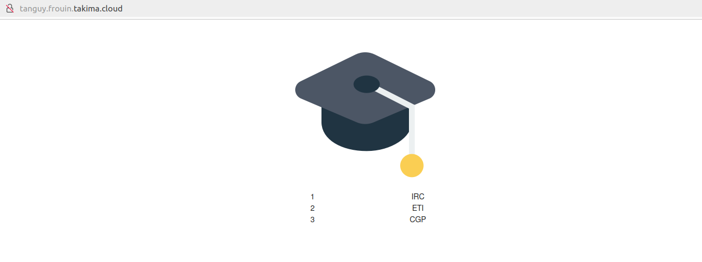

# Devops TP 3 ansible

Tanguy FROUIN 5IRC

Remarque:  
Utilisation des images Docker de Rémy DAVID comme les TP1 et 2 n'ont pas été faits

3.1  

inventories setup  


Résultats :  


Playbook


Résultat playbook


### Rôles 

3.2

```bash
ansible-galaxy init roles/docker
- Role roles/docker was created successfully
```
On déplace l'installation de docker dans le `main.yml` du rôle `docker` :  


Ajout du rôle `docker` dans le contenu du playbook :  


Résultat :  


Création des rôles :  
```bash
ansible-galaxy init roles/install-docker
ansible-galaxy init roles/create-network
ansible-galaxy init roles/launch-database
ansible-galaxy init roles/launch-app
ansible-galaxy init roles/launch-proxy
```


inventories setup.yml  


Ajout des rôles dans le playbook  (on peut virer le rôle `docker` qui sera remplacé par `install-docker`)


create-network  


Instruction d'installation dans install-docker  


Variables d'env pour se connecter à la BDD  
  
launch-app  


launch-database  


launch-proxy  


Résultat API :  


### Front  

Creation du rôle `launch-front`:  
```bash
ansible-galaxy init roles/launch-front
```

Ajout du rôle dans le playbook  


Modification des tasks pour chaque rôle `launch-x`:  
  
launch-front  


launch-database  


launch-app  


launch-proxy  


Résultats  


